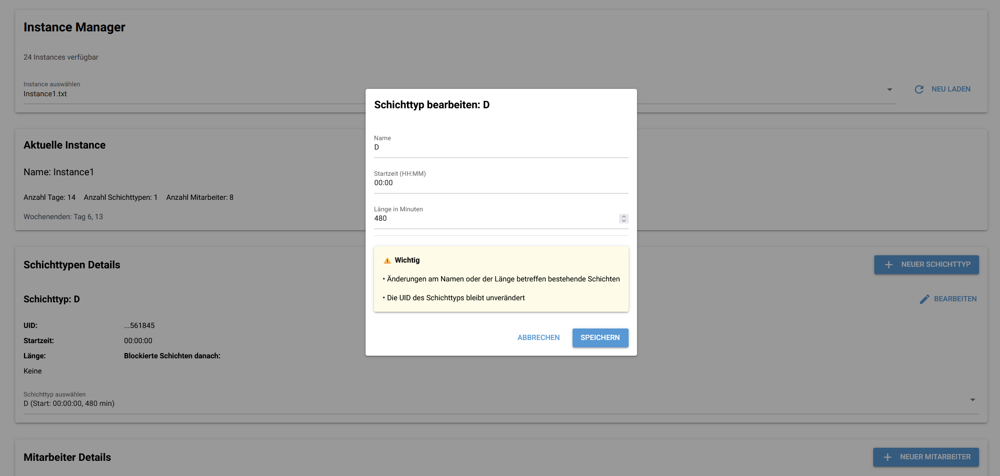
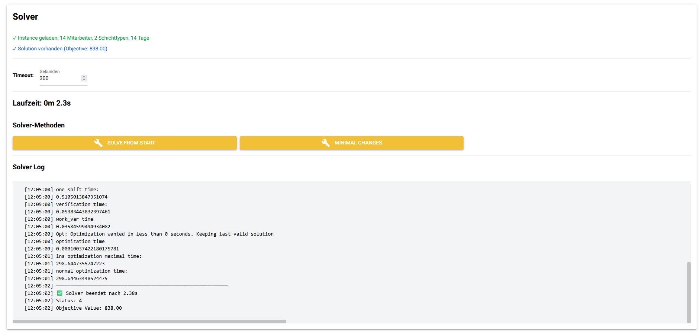
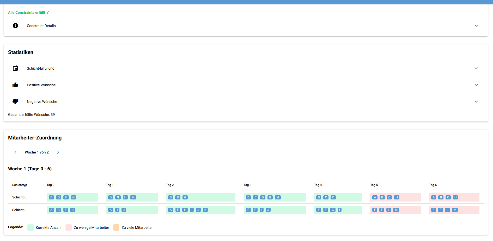
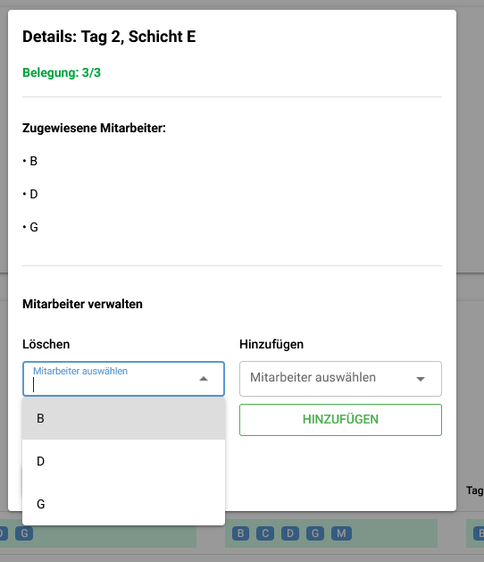

# Nurse Rostering Project

Dieses Projekt behandelt das Nurse Rostering Problem mit einer Kombination aus CP-SAT und Large Neighborhood Search (LNS). Ziel ist es, Mitarbeiterpläne effizient zu erzeugen und bei Änderungen schnell neu zu berechnen. Dabei werden Instanzen und Lösungen als JSON gespeichert und die Eingaben durch Pydantic validiert.

## Problemstellung

Das Ziel des Projekts ist die Erstellung eines validen Dienstplans für Pflegekräfte unter Berücksichtigung von Constraints und Anforderungen. Die Lösung muss nicht nur feasible sein, sondern auch in der Praxis nutzbar bleiben, wenn sich Anforderungen oder Eingabedaten ändern.

## Lösungsansatz
Zunächst wird eine initiale Lösung erstellt, indem eine vereinfachte Version der Instanz mit CP-SAT gelöst wird. Diese erste Lösung dient als Ausgangsbasis für die weitere Optimierung.

Anschließend wird die Lösung mit Large Neighborhood Search (LNS) schrittweise verbessert. Dabei werden jeweils nur begrenzte Zeiträume der Planung erneut durch CP-SAT gelöst, während die restlichen Informationen der bestehenden Lösung als Randbedingungen berücksichtigt werden. Dadurch bleibt die Berechnung effizient, auch bei größeren Instanzen.

Wenn sich eine Instanz oder ein Teil der Anforderungen ändert, wird ebenfalls nur der betroffene Zeitraum der Lösung neu bewertet und angepasst. So lassen sich Änderungen schnell und gezielt integrieren, ohne die gesamte Planung erneut vollständig neu zu berechnen.

## GUI

Die Benutzeroberfläche wurde mit NiceGUI erstellt. Sie ermöglicht das Auswählen, Bearbeiten und Überprüfen von Instanzen sowie das Starten des Solvers und die Darstellung der Ergebnisse.

### Beispielansichten

Instanzen auswählen und bearbeiten


Solver starten und Ausgabe anzeigen


Lösung anzeigen


Lösung bearbeiten


## Installation

Um das Projekt lokal zu installieren, wird folgendes Kommando verwendet:

```bash
pip install -e ".[dev]"
```

## Ausführung

Nach der Installation kann die GUI gestartet werden:

```bash
./gui
```